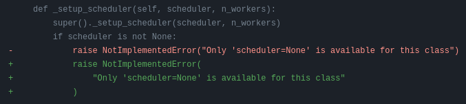
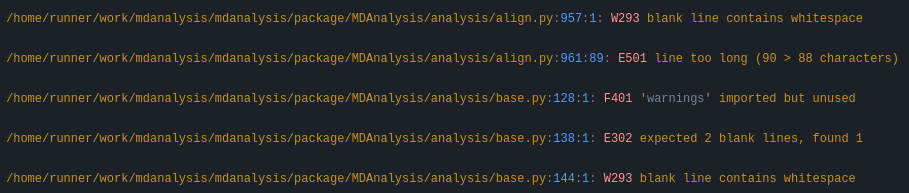

.. _working-with-mdanalysis-code:

=================================
Contributing to the main codebase
=================================

If you would like to contribute, start by searching through the `issues <https://github.com/MDAnalysis/mdanalysis/issues>`_ and `pull requests <https://github.com/MDAnalysis/mdanalysis/pulls>`_ to see whether someone else has raised a similar idea or question.

If you don't see your idea or problem listed, do one of the following:

    * If your contribution is **minor**, such as a typo fix, go ahead and fix it by following the guide below and :ref:`open a pull request <adding-code-to-mda>`.

    * If your contribution is **major**, such as a bug fix or a new feature, start by opening an issue first. That way, other people can weigh in on the discussion before you do any work. If you also create a pull request, you should link it to the issue by including the issue number in the pull request's description.

Here is an overview of the development workflow for code or inline code documentation, as expanded on throughout the rest of the page.

    #. :ref:`Fork the MDAnalysis repository <forking-code-repo>` from the mdanalysis account into your own account
    #. :ref:`Set up an isolated virtual environment <create-virtual-environment>` for code development
    #. :ref:`Build development versions <build-mdanalysis-develop>` of MDAnalysis and MDAnalysisTests on your computer into the virtual environment
    #. :ref:`Create a new branch off the develop branch <create-code-branch>`
    #. :ref:`Add your new feature or bug fix <writing-new-code>` or :ref:`add your new documentation <guidelines-for-docstrings>`
    #. :ref:`Add and run tests <testing>` (if adding to the code)
    #. :ref:`Build and view the documentation <building-code-documentation>` (if adding to the docs)
    #. :ref:`Ensure PEP8 compliance (mandatory) <format-darker>` and format your code with Darker (optional)
    #. :ref:`Commit and push your changes, and open a pull request. <adding-code-to-mda>`

Working with the code
=====================

.. _forking-code-repo:

-------
Forking
-------

You will need your `own fork <https://help.github.com/en/github/getting-started-with-github/fork-a-repo>`_ to work on the code. Go to the `MDAnalysis project page <https://github.com/MDAnalysis/mdanalysis>`_ and hit the :guilabel:`Fork` button. You will
want to `clone your fork <https://help.github.com/en/github/creating-cloning-and-archiving-repositories/cloning-a-repository>`_ to your machine:

.. code-block:: bash

    git clone https://github.com/your-user-name/mdanalysis.git
    cd mdanalysis
    git remote add upstream https://github.com/MDAnalysis/mdanalysis

This creates the directory `mdanalysis` and connects your repository to
the upstream (main project) MDAnalysis repository.

.. _create-virtual-environment:

----------------------------------
Creating a development environment
----------------------------------

To change code and test changes, you'll need to build both **MDAnalysis** and **MDAnalysisTests**
from source. This requires a Python environment. We highly recommend that you use
virtual environments. This allows you to have multiple experimental development versions
of MDAnalysis that do not interfere with each other, or your own stable version.
Since MDAnalysis is split into the actual package and a test suite, you need to install
both modules in development mode.

You can do this either with :ref:`conda <dev-with-conda>` or :ref:`pip <dev-with-pip>`.

.. note::
    If you are a first time contributor and/or don't have a lot of experience managing
    your own Python virtual environments, we **strongly** suggest using :code:`conda`.
    You only need to follow the sections corresponding to the installation method you
    choose.

.. _dev-with-conda:

With conda-forge packages
-------------------------

We will use pre-compiled packages from the `conda-forge <https://conda-forge.org/>`_ repository.

The program to manage these packages is called :program:`conda` although for the following we recommend using the faster one called :program:`mamba`. We will use ``mamba`` for the examples but you can equally use ``conda`` instead.

* For ``mamba``, follow the `mamba installation instructions <https://mamba.readthedocs.io/en/latest/installation/mamba-installation.html>`_ or the `miniforge installation instructions <https://github.com/conda-forge/miniforge?tab=readme-ov-file#install>`_.
* For ``conda`` install either the  `Anaconda <https://www.anaconda.com/download/>`_ distribution or `miniconda <https://conda.io/miniconda.html>`_.

Make sure your :program:`mamba` (or :program:`conda`) is up to date:

    .. code-block:: bash

        mamba update mamba

Create a new environment with ``mamba create``. This will allow you to change code in
an isolated environment without touching your base Python installation, and without
touching existing environments that may have stable versions of MDAnalysis. :

    .. code-block:: bash

        mamba create --name mdanalysis-dev "python>=3.12"

Use a recent version of Python that is supported by MDAnalysis for this environment.

Activate the environment to build MDAnalysis into it:

    .. code-block:: bash

        mamba activate mdanalysis-dev

.. warning::
    Make sure the :code:`mdanalysis-dev` environment is active when developing MDAnalysis.

To view your environments:

    .. code-block:: bash

        mamba info -e

To list the packages installed in your current environment:

    .. code-block:: bash

        mamba list

.. note::
    When you finish developing MDAnalysis you can deactivate the environment with
    :code:`mamba deactivate`, in order to return to your root environment.

See the full `mamba documentation <https://mamba.readthedocs.io/en/latest/index.html>`_ or the full `conda documentation <https://docs.conda.io/projects/conda/>`_ for more details.

.. _dev-with-pip:

With pip and virtualenv
-----------------------

Like conda, virtual environments managed with `virtualenv <https://virtualenv.pypa.io/en/latest/>`_ allow you to use different versions of Python and Python packages for your different project. Unlike conda, virtualenv is not a general-purpose package manager. Instead, it leverages what is available on your system, and lets you install Python packages using :program:`pip`.

To use virtual environments you have to install the virtualenv package first. This can be done with pip:

    .. code-block:: bash

        python -m pip install virtualenv

Virtual environments can be created for each project directory.

    .. code-block:: bash

        cd my-project/
        virtualenv my-project-env

This will create a new folder ``my-project-env``. This folder contains the virtual environment and all packages you have installed in it. To activate it in the current terminal run:

    .. code-block:: bash

        source myproject-env/bin/activate

Now you can install packages via pip without affecting your global environment. The packages that you install when the environment is activated will be available in terminal sessions that have the environment activated.

.. note::
    When you finish developing MDAnalysis you can deactivate the environment with
    :code:`deactivate`, in order to return to your root environment.

The `virtualenvwrapper package <https://virtualenvwrapper.readthedocs.io/en/latest/>`_ makes virtual environments easier to use. It provides some very useful features:

    - it organises the virtual environment into a single user-defined directory, so they are not scattered throughout the file system;
    - it defines commands for the easy creation, deletion, and copying of virtual environments;
    - it defines a command to activate a virtual environment using its name;
    - all commands defined by ``virtualenvwrapper`` have tab-completion for virtual environment names.

You first need to install ``virtualenvwrapper`` *outside* of a virtual environment:

    .. code-block:: bash

        python -m pip install virtualenvwrapper

Then, you need to load it into your terminal session. Add the following lines in ``~/.bashrc``. They will be executed every time you open a new terminal session:

    .. code-block:: bash

        # Decide where to store the virtual environments
        export WORKON_HOME=~/Envs
        # Make sure the directory exists
        mkdir -p ${WORKON_HOME}
        # Load virtualenvwrapper
        source /usr/local/bin/virtualenvwrapper.sh

Open a new terminal or run ``source ~/.bashrc`` to update your session. You can now create a virtual environment with:

    .. code-block:: bash

        mkvirtualenv my-project

Regardless of your current working directory, the environment is created in ``~/Envs/`` and it is now loaded in our terminal session.

You can load your virtual environments by running ``workon my-project``, and exit them by running ``deactivate``.

Virtual environments, especially with ``virtualenvwrapper``, can do much more. For example, you can create virtual environments with different python interpreters with the ``-p`` flag. The Hitchhiker's Guide to Python has a good `tutorial <https://docs.python-guide.org/dev/virtualenvs/>`_ that gives a more in-depth explanation of virtual environments. The `virtualenvwrapper documentation <https://virtualenvwrapper.readthedocs.io/en/latest/>`_ is also a good resource to read.

On a Mac
--------

One more step is often required on macOS, because of the default number of files that a process can open simultaneously is quite low (256). To increase the number of files that can be accessed, run the following command:

    .. code-block:: bash

        ulimit -n 4096

This sets the number of files to 4096. However, this command only applies to your currently open terminal session. To keep this high limit, add the above line to your ``~/.profile``.

.. _build-mdanalysis-develop:

-------------------
Building MDAnalysis
-------------------

With mamba/conda
----------------

.. note::
    Make sure that you have :ref:`cloned the repository <forking-code-repo>`
    and activated your virtual environment with :code:`mamba activate mdanalysis-dev`.

First we need to install the dependencies. To install the base MDAnalysis
dependencies, do the following:

    .. code-block:: bash

<<<<<<< Updated upstream
        mamba install -c conda-forge \
          'cython>=0.28' \
          'fasteners' \
          'griddataformats>=0.4.0' \
          'hypothesis' \
          'matplotlib-base>=1.5.1' \
          'mdahole2-base' \
          'mda-xdrlib' \
          'mmtf-python>=1.0.0' \
          'numpy>=1.23.2' \
          'packaging' \
          'pathsimanalysis' \
          'pytest' \
          'scipy>=1.5.0' \
          'threadpoolctl' \
          'tqdm>=4.43.0' \
          'waterdynamics'

You can also install the following optional dependencies, although please note
that they many not all be available for your machine type. Specifically,
*hole2*, and *distopia* are only available on Linux + x86_64 machines, and *openmm*
is not available for Windows. Simply remove any optional package that
is not available for your operating system/architecture from your list.

    .. code-block:: bash

        mamba install -c conda-forge \
          'biopython>=1.80' \
          'chemfiles>=0.10' \
          'clustalw=2.1' \
          'dask>=2023.1.1' \
          'distopia>=0.2.0' \
          'duecredit' \
          'gsd>3.0.0' \
          'h5py>=2.1.0' \
          'hole2' \
          'joblib>=0.12' \
          'netcdf4' \
          'networkx' \
          'openmm' \
          'parmed' \
          'pyedr>0.7.0' \
          'pytest-xdist' \
          'pytest-cov' \
          'pytest-timeout' \
          'pytng>=0.2.3' \
          'rdkit>=2020.03.1' \
          'scikit-learn' \
          'seaborn>=0.7.0' \
          'tidynamics>1.0.0'
=======
        conda install -c bioconda -c conda-forge \
            biopython chemfiles clustalw==2.1 codecov cython \
            griddataformats gsd hypothesis "joblib>=0.12" \
            matplotlib mmtf-python mock netcdf4 networkx \
            "numpy>=1.18.0" psutil pytest scikit-learn scipy \
            "seaborn>=0.7.0" sphinx "tidynamics>=1.0.0" \
            "tqdm>=4.43.0" "black=24"
>>>>>>> Stashed changes

        # documentation dependencies
        mamba install -c conda-forge \
          'mdanalysis-sphinx-theme>=1.3.0' \
          docutils \
          sphinxcontrib-bibtex \
          sphinx-sitemap

Ensure that you have a working C/C++ compiler (e.g. :program:`gcc` or :program:`clang`). You will also need Python ≥ 3.10 (which you already installed in your virtual environment). We will now install MDAnalysis.

    .. code-block:: bash

        # go to the mdanalysis source directory
        cd mdanalysis/

        # Build and install the MDAnalysis package
        cd package/
        python -m pip install -e .

        # Build and install the test suite
        cd ../testsuite/
        python -m pip install -e .

At this point you should be able to import MDAnalysis from your locally built version. If you are running the development version, this is visible from the version number ending in :code:`-dev0`. For example:

    .. code-block:: bash

        $ python  # start an interpreter
        >>> import MDAnalysis as mda
        >>> mda.__version__
        '2.8.0-dev0'

With pip and virtualenv
-----------------------

.. note::
    Make sure that you have :ref:`cloned the repository <forking-code-repo>`
    and activated your virtual environment with :code:`source myproject-env/bin/activate`
    (or :code:`workon my-project` if you used the `virtualenvwrapper package <https://virtualenvwrapper.readthedocs.io/en/latest/>`_)

First we need to install the dependencies. To install the base MDAnalysis
dependencies, do the following:

    .. code-block:: bash

        python -m pip install \
<<<<<<< Updated upstream
          'cython>=0.28' \
          'fasteners' \
          'griddataformats>=0.4.0' \
          'hypothesis' \
          'matplotlib>=1.5.1' \
          'mdahole2' \
          'mda-xdrlib' \
          'mmtf-python>=1.0.0' \
          'numpy>=1.23.2' \
          'packaging' \
          'pathsimanalysis' \
          'pytest' \
          'scipy>=1.5.0' \
          'threadpoolctl' \
          'tqdm>=4.43.0' \
          'waterdynamics'
=======
          biopython chemfiles codecov cython \
          griddataformats gsd hypothesis "joblib>=0.12" matplotlib \
          msmb_theme==1.2.0 netcdf4 networkx "numpy>=1.18.0" \
          psutil pytest scikit-learn scipy "seaborn>=0.7.0" \
          sphinx sphinx_rtd_theme "tidynamics>=1.0.0" \
          "tqdm>=4.43.0" "black=24"
>>>>>>> Stashed changes

You can also install the following optional dependencies (note that
you will not be able to install all the optional dependencies as
many not available via `pip`, e.g. `clustalw`):

    .. code-block:: bash

        python -m pip install \
          'biopython>=1.80' \
          'chemfiles>=0.10' \
          'dask>=2023.1.1' \
          'distopia>=0.2.0' \
          'duecredit' \
          'gsd>3.0.0' \
          'h5py>=2.1.0' \
          'joblib>=0.12' \
          'netcdf4' \
          'networkx' \
          'parmed' \
          'pyedr>0.7.0' \
          'pytest-xdist' \
          'pytest-cov' \
          'pytest-timeout' \
          'pytng>=0.2.3' \
          'rdkit>=2020.03.1' \
          'scikit-learn' \
          'seaborn>=0.7.0' \
          'tidynamics>1.0.0'

        # documentation dependencies
        python -m pip install \
          'mdanalysis-sphinx-theme>=1.3.0' \
          docutils \
          sphinxcontrib-bibtex \
          sphinx-sitemap

Ensure that you have a working C/C++ compiler (e.g. gcc or clang). You will also need Python ≥ 3.10. We will now install MDAnalysis.

    .. code-block:: bash

        # go to the mdanalysis source directory
        cd mdanalysis/

        # Build and install the MDAnalysis package
        cd package/
        python -m pip install -e .

        # Build and install the test suite
        cd ../testsuite/
        python -m pip install -e .

At this point you should be able to import MDAnalysis from your locally built version. If you are running the development version, this is visible from the version number ending in "-dev0". For example:

    .. code-block:: bash

        $ python  # start an interpreter
        >>> import MDAnalysis as mda
        >>> mda.__version__
        '2.8.0-dev0'

.. _branches-in-mdanalysis:

----------------------
Branches in MDAnalysis
----------------------

The most important branch of MDAnalysis is the ``develop`` branch, to which all development code for the next release is pushed.

The ``develop`` branch can be considered an "integration" branch for including your code into the next release. Only working, tested code should be committed to this branch. All code contributions ("features") should branch off ``develop``. At each release, a snapshot of the ``develop`` branch is taken, packaged and uploaded to PyPi and conda-forge.

.. _create-code-branch:

Creating a branch
-----------------

The develop branch should only contain approved, tested code, so create a
feature branch for making your changes. For example, to create a branch called
``shiny-new-feature`` from ``develop``:

    .. code-block:: bash

        git checkout -b shiny-new-feature develop

This changes your working directory to the ``shiny-new-feature`` branch.  Keep any
changes in this branch specific to one bug or feature so it is clear
what the branch brings to MDAnalysis. You can have many branches with different names
and switch in between them using the ``git checkout my-branch-name`` command.

There are several special branch names that you should not use for your feature branches:

    - ``master``
    - ``develop``
    - ``package-*``
    - ``gh-pages``

``package`` branches are used to :ref:`prepare a new production release <preparing-release>` and should be handled by the release manager only.

``master`` is the old stable code branch and is kept protected for historical reasons.

``gh-pages`` is where built documentation to be uploaded to github pages is held.

.. _writing-new-code:

----------------
Writing new code
----------------

Code formatting in Python
-------------------------

Since version 0.11.0, we are trying to update all the code to conform with `PEP8`_.

<<<<<<< Updated upstream
**Important requirements (from PEP8)**:
    - keep line length to **79 characters or less**; break long lines sensibly although for readability we may allow longer lines
    - indent with **spaces** and use **4 spaces per level**
=======
**Important requirements (from PEP8):**
>>>>>>> Stashed changes
    - naming:

        - classes: `CapitalClasses` (i.e. capitalized nouns without spaces)
        - methods and functions: `underscore_methods` (lower case, with underscores for spaces)

We recommend that you use a Python Integrated Development Environment (IDE) (`PyCharm`_ and others) or external tools like `flake8`_ for code linting. For integration of external tools with emacs and vim, check out `elpy`_ (emacs) and `python-mode`_ (vim).

<<<<<<< Updated upstream
To apply the code formatting in an automated way, you can also use code formatters. External tools include `autopep8`_ and `yapf`_. Most IDEs either have their own code formatter or will work with one of the above through plugins.
See :ref:`format-darker` for notes on maintaining code style compliance with existing tools.
=======
MDAnalysis uses `black`_` for automated code formatting, which is bound by the `black stability policy`_. The configuration for `black`_ is provided in the `pyproject.toml` files. To format your code with `black`_, you can run the following commands:
>>>>>>> Stashed changes

    .. code-block:: bash

        black package
        black testsuite

.. _`PEP8`: https://www.python.org/dev/peps/pep-0008/
.. _`flake8`: http://flake8.readthedocs.org/en/latest/
.. _`PyCharm`: https://www.jetbrains.com/pycharm/
.. _`elpy`: https://github.com/jorgenschaefer/elpy
.. _`python-mode`: https://github.com/klen/python-mode
.. _`black`: https://black.readthedocs.io/en/stable/
.. _`black stability policy`: https://black.readthedocs.io/en/stable/the_black_code_style/index.html#stability-policy

Modules and dependencies
------------------------

MDAnalysis strives to keep dependencies small and lightweight. Code outside the :mod:`MDAnalysis.analysis` and :mod:`MDAnalysis.visualization` modules should only rely on the :ref:`core dependencies <core-module-dependencies>`, which are always installed. Analysis and visualization modules can use any :ref:`any package, but the package is treated as optional <optional-modules>`.

Imports in the code should follow the :ref:`general-rules-for-importing`.

.. seealso::

    See :ref:`module-imports` for more information.

Developing in Cython
--------------------

The ``setup.py`` script first looks for the `.c` files included in the standard MDAnalysis distribution. These are not in the GitHub repository, so ``setup.py`` will use Cython to compile extensions. `.pyx` source files are used instead of `.c` files. From there, `.pyx` files are converted to `.c` files if they are newer than the already present `.c` files or if the ``--force`` flag is set (i.e. ``python setup.py build --force``). End users (or developers) should not trigger the `.pyx` to `.c` conversion, since `.c` files delivered with source packages are always up-to-date. However, developers who work on the `.pyx` files will automatically trigger the conversion since `.c` files will then be outdated.

Place all source files for compiled shared object files into the same directory as the final shared object file.

`.pyx` files and cython-generated `.c` files should be in the same directory as the `.so` files. External dependent C/C++/Fortran libraries should be in dedicated ``src/`` and ``include/`` folders. See the following tree as an example:

    ::

        MDAnalysis
            |--lib
            |   |-- _distances.so
            |   |-- distances.pyx
            |   |-- distances.c
            |-- coordinates
                |-- _dcdmodule.so
                |-- src
                    |-- dcd.c
                |-- include
                    |-- dcd.h

.. _test-code:

-----------------
Testing your code
-----------------

MDAnalysis takes testing seriously. All code added to MDAnalysis should have tests to ensure that it works as expected; we aim for 90% coverage. See :ref:`testing` for more on :ref:`writing <write-new-tests>`, :ref:`running <run-test-suite>`, and interpreting tests.

---------------------
Documenting your code
---------------------

Changes to the code should be reflected in the ongoing ``CHANGELOG``. Add an entry here to document your fix, enhancement, or change. In addition, add your name to the author list. If you are addressing an issue, make sure to include the issue number.

.. _format-darker:

-------------------------------------------------------------------------------
Ensure PEP8 compliance (mandatory) and format your code with Darker (optional)
-------------------------------------------------------------------------------

`darker`_ is a *partial formatting* tool that helps to reformat new or modified code
lines so the codebase progressively adapts a code style instead of doing a full reformat,
which would be a big commitment. It was designed with the ``black`` formatter in mind, hence the name.

In MDAnalysis **we only require PEP8 compliance**, so if you want to make sure that your PR passes the darker bot, you'll
need both darker and ``flake8``: ::

    pip install darker flake8

You'll also need the original codebase so darker can first get a diff between the current ``develop`` branch and your code.
After making your changes to your local copy of the **MDAnalysis** repo, add the remote repo
(here we're naming it ``upstream``), and fetch the content: ::

    git remote add upstream https://github.com/MDAnalysis/mdanalysis.git
    git fetch upstream

Now you can check your modifications on the package: ::

    darker --diff -r upstream/develop package/MDAnalysis -L flake8

and the test suite: ::

    darker --diff -r upstream/develop testsuite/MDAnalysisTests -L flake8

Darker will first suggest changes so that the new code lines comply with ``black``'s rules, like this:

and then show flake8 errors and warnings. These look like this:

You are free to skip the diffs and then manually fix the PEP8 faults.
Or if you're ok with the suggested formatting changes, just apply the suggested fixes: ::

    darker -r upstream/develop package/MDAnalysis -L flake8
    darker -r upstream/develop testsuite/MDAnalysisTests -L flake8

.. note::

   MDAnalysis does *not* currently use the popular `black`_ code formatter across the whole project, therefore please consider the following rules:

   * **Do not run** ``black`` on an existing file that you are editing. This makes the diff for the PR very difficult to read. Instead use ``darker`` as explained above to only reformat your changes.
   * You *may* run ``black`` on a *new file* that you are adding to the code base.

   For an ongoing discussion (which you are welcome to join) see `issue #2450`_.

.. _`darker`: https://github.com/akaihola/darker
.. _`black`: https://black.readthedocs.io/
.. _`issue #2450`: https://github.com/MDAnalysis/mdanalysis/issues/2450

.. _adding-code-to-mda:

------------------------------
Adding your code to MDAnalysis
------------------------------

Committing your code
--------------------

When you are happy with a set of changes and :ref:`all the tests pass <test-code>`, it is time to commit. All changes in one revision should have a common theme. If you implemented two rather different things (say, one bug fix and one new feature), then split them into two commits with different messages.

Once you’ve made changes to files in your local repository, you can see them by typing:

    .. code-block:: bash

        git status

Tell git to track files by typing:

    .. code-block::

        git add path/to/file-to-be-added.py

Doing ``git status`` again should give something like:

    .. code-block::

        # On branch shiny-new-feature
        #
        #       modified:   /relative/path/to/file-you-added.py
        #

Then commit with:

    .. code-block:: bash

        git commit -m

This opens up a message editor.

*Always* add a descriptive comment for your commit message (feel free to be verbose!):

    - use a short (<50 characters) subject line that summarizes the change
    - leave a blank line
    - optionally, add additional more verbose descriptions; paragraphs or bullet lists (with ``-`` or ``*``) are good
    - manually break lines at 80 characters
    - manually indent bullet lists

.. seealso::

    See `Tim Pope's A Note About Git Commit Messages <http://tbaggery.com/2008/04/19/a-note-about-git-commit-messages.html>`_ for a rationale for these rules.

Pushing your code to GitHub
---------------------------

When you want your changes to appear publicly on your GitHub page, push your forked feature branch’s commits:

    .. code-block:: bash

        git push origin shiny-new-feature

Here `origin` is the default name given to your remote repository on GitHub. You can see the remote repositories:

    .. code-block:: bash

        git remote -v

If you added the upstream repository as described above you will see something like:

    .. code-block:: bash

        origin  git@github.com:your-username/mdanalysis.git (fetch)
        origin  git@github.com:your-username/mdanalysis.git (push)
        upstream        git@github.com:MDAnalysis/mdanalysis.git (fetch)
        upstream        git@github.com:MDAnalysis/mdanalysis.git (push)

Now your code is on GitHub, but it is not yet a part of the MDAnalysis project. For that to happen, a pull request needs to be submitted on GitHub.

.. _rebase-code:

Rebasing your code
------------------

Often the upstream MDAnalysis develop branch will be updated while you are working on your own code.
You will then need to update your own branch with the new code to avoid merge conflicts.
You need to first retrieve it and then `rebase <https://www.atlassian.com/git/tutorials/rewriting-history/git-rebase>`_
your branch so that your changes apply to the new code:

    .. code-block:: bash

        git fetch upstream
        git rebase upstream/develop

This will replay your commits on top of the latest development code from MDAnalysis.  If this
leads to merge conflicts, you must resolve these before submitting your pull
request.  If you have uncommitted changes, you will need to ``git stash`` them
prior to updating.  This will effectively store your changes and they can be
reapplied after updating with ``git stash apply``.

Once rebased, push your changes:

    .. code-block:: bash

        git push -f origin shiny-new-feature

and `create a pull request <https://github.com/MDAnalysis/mdanalysis/pulls>`_.

.. _create-a-pull-request:

Creating a pull request
-----------------------

The typical approach to adding your code to MDAnalysis is to make a `pull request <https://help.github.com/en/github/collaborating-with-issues-and-pull-requests/about-pull-requests>`_ on GitHub. Please make sure that your contribution :ref:`passes all tests <test-code>`. If there are test failures, you will need to address them before we can review your contribution and eventually merge them. If you have problems with making the tests pass, please ask for help! (You can do this in the comments of the pull request).

    #. Navigate to your repository on GitHub
    #. Click on the :guilabel:`Pull Request` button
    #. You can then click on :guilabel:`Commits` and :guilabel:`Files Changed` to make sure everything looks okay one last time
    #. Write a description of your changes and follow the PR checklist

        - check that docs are updated
        - check that tests run
        - check that you've updated CHANGELOG
        - reference the issue that you address, if any

    #. Click :guilabel:`Send Pull Request`.

Your pull request is then sent to the repository maintainers. After this, the following happens:

    #. A :ref:`suite of tests are run on your code <continuous-integration>` with the tools :ref:`travis`, :ref:`appveyor` and :ref:`codecov`. If they fail, please fix your pull request by pushing updates to it.
    #. Developers will ask questions and comment in the pull request. You may be asked to make changes.
    #. When everything looks good, a core developer will merge your code into the ``develop`` branch of MDAnalysis. Your code will be in the next release.

If you need to make changes to your code, you can do so on your local repository as you did before. Committing and pushing the changes will  update your pull request and restart the automated tests.

.. _working-with-mdanalysis-docs:

Working with the code documentation
===================================

MDAnalysis maintains two kinds of documentation:

    #. `This user guide <https://www.mdanalysis.org/UserGuide/>`__: a map of how MDAnalysis works, combined with tutorial-like overviews of specific topics (such as the analyses)

    #. `The documentation generated from the code itself <https://www.mdanalysis.org/docs/>`__. Largely built from code docstrings, these are meant to provide a clear explanation of the usage of individual classes and functions. They often include technical or historical information such as in which version the function was added, or deprecation notices.

This guide is for the documentation generated from the code. If you are looking to contribute to the user guide, please see :ref:`working-with-user-guide`.

MDAnalysis has a lot of documentation in the Python doc strings. The docstrings follow the `Numpy Docstring Standard <https://numpydoc.readthedocs.io/en/latest/format.html#docstring-standard>`__, which is used widely
in the Scientific Python community. They are nice to read as normal text and are converted by sphinx to normal ReST through `napoleon <http://sphinxcontrib-napoleon.readthedocs.org/en/latest/index.html>`__.

This standard specifies the format of
the different sections of the docstring. See `this document
<https://numpydoc.readthedocs.io/en/latest/format.html#docstring-standard>`_
for a detailed explanation, or look at some of the existing functions to
extend it in a similar manner.

Note that each page of the  `online documentation <https://www.mdanalysis.org/docs/>`_ has a link to the *Source* of the page. You can look at it in order to find out how a particular page has been written in reST and copy the approach for your own documentation.

.. _building-code-documentation:

--------------------------
Building the documentation
--------------------------

The online documentation is generated from the pages in ``mdanalysis/package/doc/sphinx/source/documentation_pages``. The documentation for the current release are hosted at www.mdanalysis.org/docs, while the development version is at www.mdanalysis.org/mdanalysis/.

In order to build the documentation, you must first :ref:`clone the main MDAnalysis repo <forking-code-repo>`. :ref:`Set up a virtual environment <create-virtual-environment>` in the same way as you would for the code (you should typically use the same environment as you do for the code). Build the development version of MDAnalysis.

Then, generate the docs with:

    .. code-block:: bash

        cd doc/sphinx && make html

This generates and updates the files in ``doc/html``. If the above command fails with an ``ImportError``, run

    .. code-block:: bash

        python setup.py build_ext --inplace

and retry.

You will then be able to open the home page, ``doc/html/index.html``, and look through the docs. In particular, have a look at any pages that you tinkered with. It is typical to go through multiple cycles of fix, rebuild the docs, check and fix again.

If rebuilding the documentation becomes tedious after a while, install the :ref:`sphinx-autobuild <autobuild-sphinx>` extension.

-------------------------
Where to write docstrings
-------------------------

When writing Python code, you should always add a docstring to each public (visible to users):

    * module
    * function
    * class
    * method

\When you add a new module, you should include a docstring with a short sentence describing what the module does, and/or a long document including examples and references.

.. _guidelines-for-docstrings:

---------------------------------
Guidelines for writing docstrings
---------------------------------

A typical function docstring looks like the following:

    ::

        def func(arg1, arg2):
            """Summary line.

            Extended description of function.

            Parameters
            ----------
            arg1 : int
                Description of `arg1`
            arg2 : str
                Description of `arg2`

            Returns
            -------
            bool
                Description of return value

            """
            return True

.. seealso::

    The `napoleon documentation <https://sphinxcontrib-napoleon.readthedocs.io/en/latest/example_numpy.html>`_ has further breakdowns of docstrings at the module, function, class, method, variable, and other levels.

* When writing reST markup, make sure that there are **at least two blank lines above** the reST after a numpy heading. Otherwise, the Sphinx/napoleon parser does not render correctly.

    .. code-block:: RST

        some more docs bla bla

        Notes
        -----
        THE NEXT TWO BLANK LINES ARE IMPORTANT.

        .. versionadded:: 0.16.0

* Do not use "Example" or "Examples" as a normal section heading (e.g. in module level docs): *only* use it as a `NumPy doc Section <https://numpydoc.readthedocs.io/en/latest/format.html#docstring-standard>`__. It will not be rendered properly, and will mess up sectioning.

* When writing multiple common names in one line, Sphinx sometimes tries to reference the first name. In that case, you have to split the names across multiple lines. See below for an example:

    .. code-block:: RST

        Parameters
        ----------
        n_atoms, n_residues : int
            numbers of atoms/residues

* We are using MathJax with sphinx so you can write LaTeX code in math tags.

    In blocks, the code below

        .. code-block:: rst

            #<SPACE if there is text above equation>
            .. math::
                e^{i\pi} = -1

    renders like so:

        .. math::
            e^{i\pi} = -1

    Math directives can also be used inline.

        .. code-block:: rst

            We make use of the identity :math:`e^{i\pi} = -1` to show...

    Note that you should *always* make doc strings with math code **raw** python strings **by prefixing them with the letter "r"**, or else you will get problems with backslashes in unexpected places.

        ::

            def rotate(self, R):
                r"""Apply a rotation matrix *R* to the selection's coordinates.

                :math:`\mathsf{R}` is a 3x3 orthogonal matrix that transforms a vector
                :math:`\mathbf{x} \rightarrow \mathbf{x}'`:

                .. math::

                \mathbf{x}' = \mathsf{R}\mathbf{x}
                """

    .. seealso::

        See `Stackoverflow: Mathjax expression in sphinx python not rendering correctly <http://stackoverflow.com/questions/16468397/mathjax-expression-in-sphinx-python-not-rendering-correclty">`_ for further discussion.

-------------------
Documenting changes
-------------------

.. _versionadded: https://www.sphinx-doc.org/en/master/usage/restructuredtext/directives.html#directive-versionadded
.. _versionchanged: https://www.sphinx-doc.org/en/master/usage/restructuredtext/directives.html#directive-versionchanged
.. _deprecated: https://www.sphinx-doc.org/en/master/usage/restructuredtext/directives.html#directive-deprecated

We use reST constructs to annotate *additions*, *changes*, and *deprecations* to the code so that users can quickly learn from the documentation in which version of MDAnalysis the feature is available.

A **newly added module/class/method/attribute/function** gets a `versionadded`_  directive entry in its primary doc section, as below.

.. code-block:: rst

   .. versionadded:: X.Y.Z

For parameters and attributes, we typically mention the new entity in a `versionchanged`_ section of the function or class (although a `versionadded`_ would also be acceptable).

**Changes** are indicated with a `versionchanged`_ directive

.. code-block:: rst

   .. versionchanged:: X.Y.Z
      Description of the change. Can contain multiple descriptions.
      Don't assume that you get nice line breaks or formatting, write your text in
      full sentences that can be read as a paragraph.

**Deprecations** (features that are not any longer recommended for use and that will be removed in future releases) are indicated by the `deprecated`_ directive:

.. code-block:: rst

   .. deprecated:: X.Y.Z
      Describe (1) alternatives (what should users rather use) and
      (2) in which future release the feature will be removed.

When a feature is removed, we remove the deprecation notice and add a `versionchanged`_ to the docs of the enclosing scope. For example, when a parameter of a function is removed, we update the docs of the function. Function/class removal are indicated in the module docs. When we remove a whole module, we typically indicate it in the top-level reST docs that contain the TOC tree that originally included the module.

--------------------------------------
Writing docs for abstract base classes
--------------------------------------

MDAnalysis contains a number of abstract base classes, such as :class:`~MDAnalysis.analysis.base.AnalysisBase`. Developers who define new base classes, or modify existing ones, should follow these rules:

    - The *class docstring* needs to contain a list of methods that can be overwritten by inheritance from the base class. Distinguish and document methods as required or optional.
    - The class docstring should contain a minimal example for how to derive this class. This demonstrates best practices, documents ideas and intentions behind the specific choices in the API, helps to promote a unified code base, and is useful for developers as a concise summary of the API.
    - A more detailed description of methods should come in the *method docstring*, with a note specifying if the method is required or optional to overwrite.

See the documentation of :class:`MDAnalysis.analysis.base.AnalysisBase` for an example of this documentation.

---------------------------------------
Adding your documentation to MDAnalysis
---------------------------------------

As with any contribution to an MDAnalysis repository, :ref:`commit and push <adding-code-to-mda>` your documentation contributions to GitHub. If *any fixes in the restructured text* are needed, *put them in their own commit* (and do not include any generated files under `docs/html`). Try to keep all reST fixes in the one commit. ``git add FILE`` and ``git commit --amend`` is your friend when piling more and more small reST fixes onto a single "fixed reST" commit.

We recommend :ref:`building the docs locally first <building-code-documentation>` to preview your changes. Then, :ref:`create a pull request <create-a-pull-request>`. All the tests in the MDAnalysis test suite will run, but only one checks that the documents compile correctly.

---------------------------------------
Viewing the documentation interactively
---------------------------------------

In the Python interpreter one can simply say:

    ::

        import MDAnalysis
        help(MDAnalysis)
        help(MDAnalysis.Universe)

In ``ipython`` one can use the question mark operator:

    .. ipython::
        :verbatim:

        In [1]: MDAnalysis.Universe?
