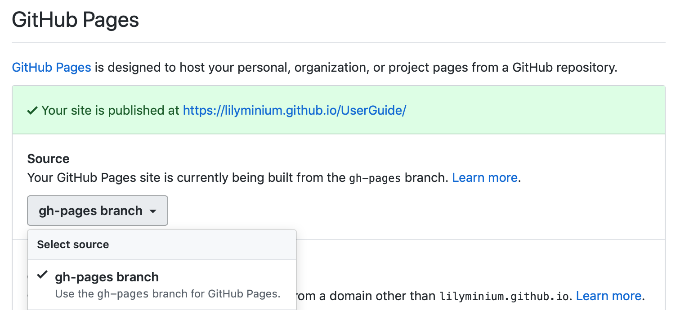

.. _working-with-user-guide:

==============================
Contributing to the user guide
==============================

MDAnalysis maintains two kinds of documentation:

    #. `This user guide <https://www.mdanalysis.org/UserGuide/>`__: a map of how MDAnalysis works, combined with tutorial-like overviews of specific topics (such as the analyses)

    #. `The documentation generated from the code itself <https://www.mdanalysis.org/docs/>`__. Largely built from code docstrings, these are meant to provide a clear explanation of the usage of individual classes and functions. They often include technical or historical information such as in which version the function was added, or deprecation notices.

This guide is about how to contribute to the user guide. If you are looking to add to documentation of the main code base, please see :ref:`working-with-mdanalysis-docs`.

Overview
========

Many code examples in the docs are run during the
doc build. This approach means that code examples will always be up to date,
but it does make the doc building a bit more complex.

Here is an overview of the development workflow for the user guide, as expanded on throughout the rest of the page.

    #. :ref:`Fork the MDAnalysis repository <forking-user-guide>` from the mdanalysis account into your own account
    #. :ref:`Set up an isolated virtual environment <create-virtual-environment-user-guide>` for your documentation
    #. :ref:`Create a new branch off the develop branch <create-code-branch>`
    #. Add your new documentation.
    #. :ref:`Build and view the documentation <build-user-guide>`.
    #. :ref:`Test your notebook cells, if applicable <nbval-testing>`.
    #. :ref:`Commit and push your changes, and open a pull request <add-changes-user-guide>`.

.. _forking-user-guide:

Forking and cloning the User Guide
==================================

Go to the `MDAnalysis project page <https://github.com/MDAnalysis/UserGuide>`_ and hit the :guilabel:`Fork` button. You will
want to clone your fork to your machine:

    .. code-block:: bash

        git clone https://github.com/your-user-name/UserGuide.git
        cd UserGuide
        git remote add upstream https://github.com/MDAnalysis/UserGuide

This creates the directory `UserGuide` and connects your repository to
the upstream (main project) MDAnalysis repository.

.. _create-virtual-environment-user-guide:

Creating a development environment
==================================

:ref:`Create a new virtual environment <create-virtual-environment>` for the user guide. Install the required dependencies, and activate the ``nglview`` extension. We use ``nglview`` for visualizing molecules in Jupyter notebook tutorials.

Using ``conda`` or similar (``miniconda``, ``mamba``, ``micromamba``), create a new environment with all the dependencies:

    .. code-block:: bash

        cd UserGuide/
        conda env create --file environment.yml --quiet
        conda activate mda-user-guide
        jupyter-nbextension enable nglview --py --sys-prefix

.. _add-new-documentation:

Adding new documentation
========================

The documentation is built using `Sphinx <https://www.sphinx-doc.org/en/master/>`_.
The user guide is largely composed of four different kinds of files:

* reStructuredText files (``.rst``) which contain the text of the documentation
* Jupyter notebooks (``.ipynb``) which contain code examples
* Python scripts (``.py``) in the ``doc/source/scripts/`` directory which are used
  for automatically generated documentation
* Text files (``.txt``) which contain the automatically generated documentation.
  These are largely tables and lists of topology attributes for readers, writers,
  and parsers

What file to edit
""""""""""""""""""
The structure of the user guide is a bit convoluted!
In order to figure out which file you should be editing, the easiest
way is probably to ``ctrl+F`` or otherwise search through the repository
for the text you want to edit. Otherwise, you can look at the
``index.rst`` file in the ``doc/source`` directory.
This file contains the *home page* of the user guide and the "overall"
tables of contents for the rest of the documentation.

For example, the
``index.rst`` file might contain the following lines:

    .. code-block:: rst

        .. toctree::
            :maxdepth: 1
            :caption: Getting started
            :hidden:

            installation
            examples/quickstart
            faq
            examples/README

This tells Sphinx that the first three entries in the "Getting started" section
of the documentation are:

    #. ``installation.rst``
    #. ``examples/quickstart.ipynb``
    #. ``faq.rst``
    #. ``examples/README.rst``

All internal links in the user guide are relative to the ``doc/source`` directory.
``installation.rst``, therefore, can be found at ``UserGuide/doc/source/installation.rst``.
This is the file you should edit if you want to change the installation instructions.

Note that the ``examples/quickstart.ipynb`` entry is a Jupyter notebook.
We use the `nbsphinx`_ extension to convert Jupyter notebooks to HTML
during the doc build. All changes to the Quickstart guide should be made
to the Jupyter notebook itself, and changes will be reflected in the final
documentation.

reStructuredText files
""""""""""""""""""""""

These are the files that end in ``.rst`` and contain plain text.
reStructuredText is a markup language that is used to write
documentation for Sphinx in Python.
The `reStructuredText Primer <https://www.sphinx-doc.org/en/master/usage/restructuredtext/basics.html>`_
is a good place to start if you are unfamiliar with the syntax.

The user guide also makes use of a number of Sphinx extensions to ensure that the code examples are always up-to-date.
One example is the `ipython directive <http://matplotlib.org/sampledoc/ipython_directive.html>`__.
The ``ipython`` directive lets you put code in the documentation which will be run
during the doc build. For example:

    ::

        .. ipython:: python

            x = 2
            x**3

will be rendered as:

    .. ipython::

        In [1]: x = 2

        In [2]: x**3
        Out[2]: 8

Jupyter notebook files
""""""""""""""""""""""

Jupyter notebooks are a great way to write documentation, since they allow you to
write text and code in the same document. The user guide uses Jupyter notebooks
for all the tutorials and examples.

.. _build-user-guide:

Building the user guide
=======================

Navigate to the ``doc/`` directory and run ``make html``:

    .. code-block:: bash

        cd doc/
        make html

The HTML output will be in ``doc/build/``, which you can open in your browser of choice. The homepage is ``doc/build/index.html``.

If rebuilding the documentation becomes tedious after a while, install the :ref:`sphinx-autobuild <autobuild-sphinx>` extension.

Saving state in Jupyter notebooks
=================================

One of the neat things about ``nglview`` is the ability to interact with molecules via the viewer.
This ability can be preserved for the HTML pages generated from Jupyer notebooks by ``nbsphinx``,
if you save the notebook widget state after execution.

**However, this creates very large files** -- we ask that Jupyter notebooks have the nglview
cells commented out, so that the HTML pages are not too large.

.. _nbval-testing:

Test with pytest and nbval
===========================

Whenever you add or modify notebook cells, you should make sure they run without errors and that their
outputs are consistent, since they are part of the documentation as well.

We use a pytest plugin for this called `nbval`_, it takes advantage of the saved notebook state
and re-runs the notebook to determine if its output is still identical to the saved state.
Thus, cells not only have to work (no errors), but also must give the same output they gave when
they were saved.

To test all notebooks, just cd into ``UserGuide/tests`` and run ``pytest``.
If you want to test a particular notebook, check the the contents of `pytest.ini`, this file
defines flags that you can also pass directly to pytest.
For example, if you wanted to test the `hole2` notebook::

    pytest --nbval --nbval-current-env --nbval-sanitize-with ./sanitize_output.cfg ../doc/source/examples/analysis/polymers_and_membranes/hole2.ipynb
Where ``--nbval`` tells pytest to use nbval to test Jupyter notebooks, ``--nbval-current-env``
to use the currently loaded python environment (make sure you actually loaded your environment)
instead of trying to use the one that was used when the notebook was saved  and
``--nbval-sanitize-with`` to point pytest to a file full of replacement rules like this one
for example::

    regex: (.*B \[0.*B/s\])
    replace: DOWNLOAD
This tells pytest to scan the outputs of all cells and replace the matching string with the word
*DOWNLOAD*. This is called *sanitization*.

.. _`nbval`: https://nbval.readthedocs.io/en/latest/

Sanitization
""""""""""""
Exactly matching cell outputs between runs is a high bar for testing and tends to give false errors
-- otherwise correct cells may give different outputs each time they are run (e.g. cells with code
that outputs memory locations).
To alleviate this, before testing each cell pytest will match its output against the regular
expressions from ``sanitize_output.cfg``. This file contains replacements for strings that we know will vary.
Pytest will replace the dynamic output with these constant strings, which won't change between runs and hence prevent spurious failures.

If your code correctly outputs variable strings each time its run, you should add a replacement
rule to the ``sanitize_output.cfg`` file and try to make it as specific as possible.

On the hole2 notebook
"""""""""""""""""""""
The *hole2* notebook is special in that it requires installation of extra software to run,
namely the `hole2`_ program. If you test all the notebooks you may therefore run
into errors if hole2 is not installed. These errors can be generally ignored unless
you do specifically want to test the hole2 notebook. Of course, you should take
note of other errors that occur if hole2 is installed!
To run the hole2 notebook you'll have to download `hole2`_, compile it, and make sure your system can find
the hole2 executable. In UNIX-based systems this implies adding its path to the ``$PATH``
environmental variable like this::

    export PATH=$PATH:"<PATH_TO_HOLE2>/exe"

.. _`hole2`: https://github.com/osmart/hole2

.. _add-changes-user-guide:

Adding changes to the UserGuide
===============================

As with the code, :ref:`commit and push <adding-code-to-mda>` your code to GitHub.
Then :ref:`create a pull request <create-a-pull-request>`.
The only test run for the User Guide is: that your file compile into HTML documents without errors.
As usual, a developer will review your PR and merge the code into the User Guide when it looks good.

If you have issues building your documentation locally, pull requests
create preview documentation on ReadTheDocs, which you can use to check renders.
We believe it is best to open PRs early and often, so that we can catch issues early!

Optional steps and tips
=======================

The below sections are optional, but may be helpful for more advanced users.

Using pre-commit hooks
""""""""""""""""""""""

Manually editing files can often lead to small inconsistencies: a whitespace here, a missing carriage return there. A tool called pre-commit can be used to automatically fix these problems, before a git commit is made. To enable the pre-commit hooks, run the following:

    .. code-block:: bash

        pre-commit install

To perform the pre-commit checks on all the files, run the following:

    .. code-block:: bash

        pre-commit run --all-files

To remove the pre-commit hooks from your .git directory, run the following:

    .. code-block:: bash

        pre-commit uninstall

.. _autobuild-sphinx:

Automatically building documentation
""""""""""""""""""""""""""""""""""""

Constantly rebuilding documentation can become tedious when you have many changes to make. Use `sphinx-autobuild <https://pypi.org/project/sphinx-autobuild>`_ to rebuild documentation every time you make changes to any document, including Jupyter notebooks. Install ``sphinx-autobuild``:

    .. code-block:: bash

        pip install sphinx-autobuild

Then, run the following command in the ``doc/`` directory:

    .. code-block:: bash

        python -m sphinx_autobuild source build

This will start a local webserver at http://localhost:8000/, which will refresh every time you save changes to a file in the documentation. This is helpful for both the user guide (first navigate to ``UserGuide/doc``) and the main repository documentation (navigate to ``package/doc/sphinx``).

Advanced preview with gh-pages
""""""""""""""""""""""""""""""

.. note::

    This section documents how to render documentation on a fork without ReadTheDocs.
    This is *generally unnecessary* and should only be done in cases where we
    believe ReadTheDocs is not rendering our documentation properly.
    For all other cases, please use the ReadTheDocs preview in pull requests.

It is often difficult to review Jupyter notebooks on GitHub, especially if you embed widgets and images.
One way to make it easier on the developers who review your changes is to build the changes on your forked repository and link the relevant sections in your pull request.
To do this, create a ``gh-pages`` branch and merge your new branch into it.

.. code-block:: bash

    # the first time
    git checkout -b gh-pages
    git merge origin/my-new-branch

Fix any merge conflicts that arise. Then edit ``UserGuide/doc/source/conf.py`` and change the URL of the site, which is set to ``site_url = "https://www.mdanalysis.org/UserGuide"``. Change it to your personal site, e.g. ::

    site_url = "https://www.my_user_name.github.io/UserGuide"

Now you can build your pages with the ``make github`` macro in the ``UserGuide/doc/`` directory, which builds the files and copies them to the top level of your directory.

.. code-block:: bash

    make github

You should be able to open one of these new HTML files (e.g. ``UserGuide/index.html``) in a browser and navigate your new documentation. Check that your changes look right. If they are, push to your `gh-pages` branch from the ``UserGuide/`` directory.

.. code-block:: bash

    git add .
    git commit -m 'built my-new-branch'
    git push -f origin gh-pages

On GitHub, navigate to your fork of the repository and go to **Settings**. In the **GitHub Pages** section, select the "gh-pages branch" from the **Source** dropdown. Check that your website is published at the given URL.

For each time you add changes to another branch later, just merge into gh-pages and rebuild.

.. code-block:: bash

    git checkout gh-pages
    git merge origin/my_branch
    cd doc/
    make github

.. _nbsphinx: https://nbsphinx.readthedocs.io