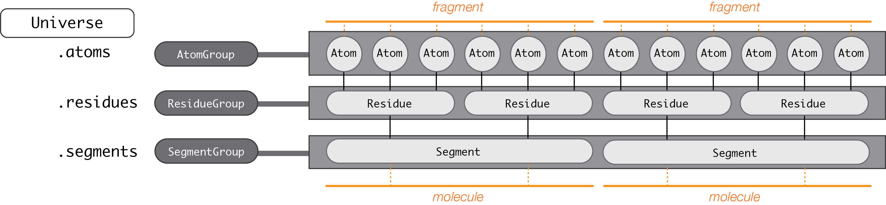

.. -*- coding: utf-8 -*-

===============
Data structures
===============

Universe
========

    *If you wish to make an apple pie from scratch, you must first invent the universe.*

    -- Carl Sagan, Cosmos

MDAnalysis is structured around two fundamental classes: the :code:`Universe` and the :code:`AtomGroup`. Almost all code in MDAnalysis begins with :code:`MDAnalysis.Universe`, which contains all the information describing a molecular dynamics system. 

It has two key properties:

* :code:`atoms`: an :code:`AtomGroup` of the system's atoms, providing access to important analysis methods (described below)
* :code:`trajectory`: the currently loaded trajectory reader

A :code:`Universe` ties the static information from the "topology" (e.g. atom identities) to dynamically updating information from the "trajectory" (e.g. coordinates). A cornerstone of MDAnalysis' ontology is that an entire trajectory is never loaded into memory. Instead, the :code:`trajectory` attribute provides a view on a specific frame of the trajectory. This allows the analysis of arbitrarily long trajectories without a significant impact on memory. 

-------------------
Creating a Universe
-------------------

Loading from files
------------------

A Universe is typically created from a "topology" file, with optional "trajectory" file/s. Trajectory files must have the coordinates in the same order as atoms in the topology. See `Formats <https://www.mdanalysis.org/UserGuide/formats>`_ for the topology and trajectory formats supported by MDAnalysis, and how to load each specific format.

.. code-block:: python

    u = Universe(topology, trajectory)          
    u = Universe(pdbfile)                       # read atoms and coordinates from PDB or GRO
    u = Universe(topology, [traj1, traj2, ...]) # read from a list of trajectories
    u = Universe(topology, traj1, traj2, ...)   # read from multiple trajectories

The line between topology and trajectory files is quite blurry. For example, a PDB or GRO file is considered both a topology and a trajectory file. The difference is that a **topology file** provides static information, such as atom identities (name, mass, etc.), charges, and bond connectivity. A **trajectory file** provides dynamic information, such as coordinates, velocities, forces, and box dimensions. 

If only a single file is provided, MDAnalysis tries to read both topology and trajectory information from it. If multiple trajectory files are provided, coordinates are loaded in the order given. If :code:`continuous=True` is passed, the time steps are modified for a time-continuous trajectory.

The default arguments should create a Universe suited for most analysis applications. However, the :code:`Universe` constructor also takes optional arguments.

**The following options specify how to treat the input:**

* :code:`format`: the file format of the trajectory file/s. (default: None, formats are guessed)
* :code:`topology_format`: the file format of the topology file. (default: None, formats are guessed)
* :code:`all_coordinates`: whether to read coordinate information from the first file (default: False. Ignored when only one file is provided)
* :code:`continuous`: whether to give multiple trajectory files continuous time steps. (default: False.)

.. code-block:: python

    >>> import MDAnalysis as mda
    >>> from MDAnalysis.tests.datafiles import PDB, GRO, XTC
    >>> u1 = mda.Universe(GRO, XTC, XTC, all_coordinates=True)
    >>> u1.trajectory
    <ChainReader containing adk_oplsaa.xtc, adk_oplsaa.xtc with 21 frames of 47681 atoms>
    >>> u2 = mda.Universe(GRO, XTC, XTC, all_coordinates=False, continuous=False)
    >>> u2.trajectory
    <ChainReader containing adk_oplsaa.xtc, adk_oplsaa.xtc with 20 frames of 47681 atoms>
    >>> print([int(ts.time) for ts in u2.trajectory])
    [0, 0, 100, 200, 300, 400, 500, 600, 700, 800, 900, 0, 100, 200, 300, 400, 500, 600, 700, 800, 900]
    >>> u3 = mda.Universe(GRO, XTC, XTC, all_coordinates=False, continuous=True)
    >>> u3.trajectory
    <ChainReader containing adk_oplsaa.xtc with 10 frames of 47681 atoms>
    >>> print([int(ts.time) for ts in u3.trajectory])
    [0, 100, 200, 300, 400, 500, 600, 700, 800, 900]

**The following options modify the created Universe:**

* :code:`guess_bonds`: whether to guess connectivity between atoms. (default: False)
* :code:`vdwradii`: a dictionary of :code:`{element: radius}` of van der Waals' radii for use in guessing bonds.
* :code:`transformations`: a function or list of functions for on-the-fly trajectory transformation.
* :code:`in_memory`: whether to load coordinates into memory (default: False)
* :code:`in_memory_step`: only read every nth frame into an in-memory representation. (default: 1)
* :code:`is_anchor`: whether to consider this Universe when unpickling :code:`AtomGroups` (default: True)
* :code:`anchor_name`: the name of this Universe when unpickling :code:`AtomGroups` (default: None, automatically generated)

Constructing from AtomGroups
----------------------------

A new Universe can be created from one or more :code:`AtomGroup` instances with :func:`MDAnalysis.Merge()`. The :code:`AtomGroup` instances can come from different Universes, meaning that this is one way to concatenate selections from different datasets. 

For example, to combine a protein, ligand, and solvent from separate PDB files:

.. code-block:: python

    u1 = mda.Universe("protein.pdb")
    u2 = mda.Universe("ligand.pdb")
    u3 = mda.Universe("solvent.pdb")
    u = Merge(u1.select_atoms("protein"), u2.atoms, u3.atoms)
    u.atoms.write("system.pdb")

Constructing from scratch
-------------------------

A Universe can be constructed from scratch with :func:`Universe.empty`. There are three stages to this process:

    #. Create the blank Universe with specified number of atoms. If coordinates, set :code:`trajectory=True`. 
    #. Add topology attributes such as atom names.
    #. (Optional) Load coordinates. 

For example, to construct a universe with 6 atoms in 2 residues:

.. code-block::

    >>> u = mda.Universe.empty(6, 2, atom_resindex=[0, 0, 0, 1, 1, 1],
    ...                        trajectory=True)
    >>> u.add_TopologyAttr('masses')
    >>> n_frames = 1000
    >>> coordinates = np.empty((n_frames, u.atoms.n_atoms, 3))
    >>> u.load_new(coordinates, order='fac')

`See this notebook tutorial for more information. <http://mdanalysis.org/UserGuide/examples/constructing_universe>`_

Guessing topology attributes
----------------------------

MDAnalysis can guess two kinds of information. Sometimes MDAnalysis guesses information instead of reading it from certain file formats, which can lead to mistakes such as assigning atoms the wrong element or charge. See `Formats <https://www.mdanalysis.org/UserGuide/formats>`_ for a case-by-case breakdown of which atom properties MDAnalysis guesses for each format.

It can infer connectivity from atomic positions or other topological information:

    * bonds (from atoms)
    * angles (from bonds)
    * dihedrals (from angles)
    * improper angles (from angles)

MDAnalysis can also infer atom properties from atom names or elements:

    * elements (from names)
    * types (from names; at present this just returns the element)
    * masses (from elements)

Importantly, some guessers have not been fully implemented, or occasionally MDAnalysis is unable to guess the correct value. In these cases, MDAnalysis sets certain attributes to a default value:

    * charges (from names, default 0)
    * masses (from elements, default 0.0)

See the API reference for more information on how to use guessing methods. 

-------------------------------
Universe properties and methods
-------------------------------

A Universe holds master groups of atoms and topology objects:

    * :attr:`atoms`: all Atoms in the system
    * :attr:`residues`: all Residues in the system
    * :attr:`segments`: all Segments in the system
    * :attr:`bonds`: all bond TopologyObjects in the system
    * :attr:`angles`: all angle TopologyObjects in the system
    * :attr:`dihedrals`: all dihedral TopologyObjects in the system
    * :attr:`impropers`: all improper TopologyObjects in the system

Modifying a topology is typically done through the :code:`Universe`, which contains several methods for adding properties:

    * :func:`add_TopologyAttr`
    * :func:`add_Residue`
    * :func:`add_Segment`

See `the Topology system <../topology_system.html>`_ for more information on which :code:`TopologyAttr`\ s can be added.

AtomGroup
====================

A :code:`Universe` contains all particles in the molecular system. MDAnalysis calls a particle an :code:`Atom`, regardless of whether it really is (e.g. it may be a united-atom particle or coarse-grained bead). :code:`Atom`\ s are grouped with an :code:`AtomGroup`; the 'master' :code:`AtomGroup` of a Universe is accessible at :code:`Universe.atoms`. 

The :code:`AtomGroup` is probably the most important object in MDAnalysis. Virtually everything can be accessed through an :code:`AtomGroup`. 

-----------------------
Creating an AtomGroup
-----------------------

Atom selection language
-----------------------

AtomGroup instances are typically created with :func:`Universe.select_atoms()` or by manipulating another :code:`AtomGroup`, e.g. by slicing.

.. code-block:: python

    >>> u.select_atoms('resname ARG')
    <AtomGroup with 312 atoms>

See :ref:`Selections` for more information.

Indexing and slicing
--------------------

An :code:`AtomGroup` can be indexed and sliced like a list:

.. code-block:: python

    >>> print(u.atoms[0])
    <Atom 1: N of type N of resname MET, resid 1 and segid SYSTEM and altLoc >

Slicing returns another :code:`AtomGroup`. The below code returns an :code:`AtomGroup` of every second element from the first to the 6th element, corresponding to indices 0, 2, and 4.

.. code-block:: python

    >>> ag = u.atoms[0:6:2]
    >>> print(ag)
    <AtomGroup [<Atom 1: N of type N of resname MET, resid 1 and segid SYSTEM and altLoc >, <Atom 3: H2 of type H of resname MET, resid 1 and segid SYSTEM and altLoc >, <Atom 5: CA of type C of resname MET, resid 1 and segid SYSTEM and altLoc >]>
    >>> ag.indices
    array([0, 2, 4])

MDAnalysis also supports fancy indexing: passing a :code:`numpy.ndarray` or a :code:`list`. 

.. code-block:: python

    >>> indices = [0, 3, -1, 10, 3]
    >>> u.atoms[indices].indices
    array([    0,     3, 47680,    10,     3])

Boolean indexing allows you to pass in an array of :code:`True` or :code:`False` values to create a new :code:`AtomGroup` from another. The array must be the same length as the original :code:`AtomGroup`. This allows you to select atoms on conditions.

.. code-block:: python

    >>> arr = u.atoms.resnames == 'ARG'
    >>> arr
    array([False, False, False, ..., False, False, False])
    >>> u.atoms[arr]
    <AtomGroup with 312 atoms>

Group operators and set methods
-------------------------------

MDAnalysis supports a number of ways to compare :code:`AtomGroup`\ s or construct a new one: group operators (e.g. :func:`concatenate`, :func:`subtract`) and set methods (e.g. :func:`union`, :func:`difference`). Group operators achieve a similar outcome to set methods. However, a key difference is that :func:`concatenate` and :func:`subtract` preserve the order of the atoms and any duplicates. :func:`union` and :func:`difference` return an :code:`AtomGroup` where each atom is unique, and ordered by its topology index. 

.. code-block:: python

    >>> ag1 = u.atoms[1:6]
    >>> ag2 = u.atoms[8:3:-1]
    >>> concat = ag1 + ag2
    >>> concat.indices
    array([1, 2, 3, 4, 5, 8, 7, 6, 5, 4])
    >>> union = ag1 | ag2
    >>> union.indices
    array([1, 2, 3, 4, 5, 6, 7, 8])

**Available operators**

Unlike set methods and atom selection language, concatenation and subtraction keep the order of the atoms as well as duplicates.

+-------------------------------+------------+----------------------------+
| Operation                     | Equivalent | Result                     |
+===============================+============+============================+
| ``len(s)``                    |            | number of atoms            |
|                               |            | in the group               |
+-------------------------------+------------+----------------------------+
| ``s == t``                    |            | test if ``s`` and ``t``    |
|                               |            | contain the same elements  |
|                               |            | in the same order          |
+-------------------------------+------------+----------------------------+
| ``s.concatenate(t)``          | ``s + t``  | new Group with elements    |
|                               |            | from ``s`` and from ``t``  |
+-------------------------------+------------+----------------------------+
| ``s.subtract(t)``             |            | new Group with elements    |
|                               |            | from ``s`` that are not    |
|                               |            | in ``t``                   |
+-------------------------------+------------+----------------------------+

**Available set methods**

Each of these methods create groups that are sorted sets of unique :code:`Atom`\ s.

+-------------------------------+------------+----------------------------+
| Operation                     | Equivalent | Result                     |
+===============================+============+============================+
| ``s.isdisjoint(t)``           |            | ``True`` if ``s`` and      |
|                               |            | ``t`` do not share         |
|                               |            | elements                   |
+-------------------------------+------------+----------------------------+
| ``s.issubset(t)``             |            | test if all elements of    |
|                               |            | ``s`` are part of ``t``    |
+-------------------------------+------------+----------------------------+
| ``s.is_strict_subset(t)``     |            | test if all elements of    |
|                               |            | ``s`` are part of ``t``,   |
|                               |            | and ``s != t``             |
+-------------------------------+------------+----------------------------+
| ``s.issuperset(t)``           |            | test if all elements of    |
|                               |            | ``t`` are part of ``s``    |
+-------------------------------+------------+----------------------------+
| ``s.is_strict_superset(t)``   |            | test if all elements of    |
|                               |            | ``t`` are part of ``s``,   |
|                               |            | and ``s != t``             |
+-------------------------------+------------+----------------------------+
| ``s.union(t)``                | ``s | t``  | new Group with elements    |
|                               |            | from both ``s`` and ``t``  |
+-------------------------------+------------+----------------------------+
| ``s.intersection(t)``         | ``s & t``  | new Group with elements    |
|                               |            | common to ``s`` and ``t``  |
+-------------------------------+------------+----------------------------+
| ``s.difference(t)``           | ``s - t``  | new Group with elements of |
|                               |            | ``s`` that are not in ``t``|
+-------------------------------+------------+----------------------------+
| ``s.symmetric_difference(t)`` | ``s ^ t``  | new Group with elements    |
|                               |            | that are part of ``s`` or  |
|                               |            | ``t`` but not both         |
+-------------------------------+------------+----------------------------+

Groupby and split
-----------------

An :code:`AtomGroup` can be constructed from another by separating atoms by properties. 

:func:`AtomGroup.split()` can create a list of :code:`AtomGroup`\ s by splitting another :code:`AtomGroup` by the 'level' of connectivity: one of *atom*, *residue*, *molecule*, or *segment*. 

.. code-block:: python

    >>> ag1 = u.atoms[:100]
    >>> ag1
    <AtomGroup with 100 atoms>
    >>> ag1.split('residue')
    [<AtomGroup with 19 atoms>,
    <AtomGroup with 24 atoms>,
    <AtomGroup with 19 atoms>,
    <AtomGroup with 19 atoms>,
    <AtomGroup with 19 atoms>]

An :code:`AtomGroup` can also be separated according to values of `topology attributes <../topology_system.html#topology-attributes>`_ to produce a dictionary of :code:`{value:AtomGroup}`. 

.. code-block::

    >>> u = mda.Universe(PSF, DCD)
    >>> u.atoms.groupby('masses')
    {32.06: <AtomGroup with 7 atoms>, 1.008: <AtomGroup with 1685 atoms>, 12.011: <AtomGroup with 1040 atoms>, 14.007: <AtomGroup with 289 atoms>, 15.999: <AtomGroup with 320 atoms>}

Passing in multiple attributes groups them in order:

.. code-block::

    >>> u.atoms.groupby(['masses', 'resnames'])
    {(32.06, 'MET'): <AtomGroup with 6 atoms>, (32.06, 'CYS'): <AtomGroup with 1 atom>, (1.008, 'LEU'): <AtomGroup with 176 atoms>, (1.008, 'SER'): <AtomGroup with 25 atoms>, (1.008, 'TYR'): <AtomGroup with 63 atoms>, (1.008, 'ARG'): <AtomGroup with 169 atoms>, (1.008, 'GLU'): <AtomGroup with 108 atoms>, (1.008, 'GLY'): <AtomGroup with 60 atoms>, (1.008, 'ASN'): <AtomGroup with 24 atoms>, ..., }

Constructing from Atoms
-----------------------

An :code:`AtomGroup` can be created from an iterable of :code:`Atom`\ s:

.. code-block:: python

    >>> atom1 = u.atoms[4]
    >>> atom2 = u.atoms[6]
    >>> atom3 = u.atoms[2]
    >>> ag = mda.AtomGroup([atom1, atom2, atom3])
    >>> print(ag)
    <AtomGroup [<Atom 5: CA of type C of resname MET, resid 1 and segid SYSTEM and altLoc >, <Atom 7: CB of type C of resname MET, resid 1 and segid SYSTEM and altLoc >, <Atom 3: H2 of type H of resname MET, resid 1 and segid SYSTEM and altLoc >]>

Or from providing a list of indices and the Universe that the :code:`Atom`\ s belong to:

.. code-block:: python

    >>> ag = mda.AtomGroup([4, 6, 2], u)
    >>> print(ag)
    <AtomGroup [<Atom 5: CA of type C of resname MET, resid 1 and segid SYSTEM and altLoc >, <Atom 7: CB of type C of resname MET, resid 1 and segid SYSTEM and altLoc >, <Atom 3: H2 of type H of resname MET, resid 1 and segid SYSTEM and altLoc >]>

Order and uniqueness
-----------------------

These methods of creating an :code:`AtomGroup` result in a sorted, unique list of atoms:

    * Atom selection language
    * Slicing
    * Boolean indexing
    * Set methods
    * :func:`AtomGroup.split` and :func:`AtomGroup.groupby`
    
These methods return a user-ordered :code:`AtomGroup` that can contain duplicates:

    * Fancy indexing (with arrays or lists)
    * Group operations (:func:`concatenate` and :func:`subtract`)
    * Constructing directly from :code:`Atom`\ s

-------
Methods
-------

Most of the analysis functionality in MDAnalysis is implemented in the analysis module, but many interesting methods can be accessed from an :code:`AtomGroup` directly. 

Topology objects
----------------

An :code:`AtomGroup` can be represented as a bond, angle, dihedral angle, or improper angle :class:`TopologyObject` through the respective properties:

    * :attr:`bond`
    * :attr:`angle`
    * :attr:`dihedral`
    * :attr:`improper`

The :code:`AtomGroup` must contain the corresponding number of atoms, in the desired order. For example, a bond cannot be created from three atoms.

.. code-block:: python

    >>> u.atoms[[3, 4, 2]].bond
    Traceback (most recent call last):
    File "<stdin>", line 1, in <module>
    File "/Users/lily/pydev/mdanalysis/package/MDAnalysis/core/groups.py", line 2954, in bond
        "bond only makes sense for a group with exactly 2 atoms")
    ValueError: bond only makes sense for a group with exactly 2 atoms

However, the angle Atom 2 ----- Atom 4 ------ Atom 3 can be calculated, even if the atoms are not connected with bonds.

.. code-block:: python

    >>> a = u.atoms[[3, 4, 2]].angle
    >>> a
    <Angle between: Atom 2, Atom 4, Atom 3>
    >>> a.angle
    <bound method Angle.angle of <Angle between: Atom 2, Atom 4, Atom 3>>
    >>> a.angle()
    47.63986538582528
    >>> a.value()
    47.63986538582528

The value of each topology object can be calculated with :func:`value`, or the name of the topology object (:func:`angle` in this case). See `Topology Objects <../topology_system.html#topology-objects>`_ for more information.

Topology-specific methods
-------------------------

A number of analysis and transformation methods are defined for :code:`AtomGroup` that require specific properties to be available. The primary requirement is usually coordinates, or the `positions` attribute. With coordinates, you can easily compute a center of geometry:

.. code-block::

    >>> u.atoms.center_of_geometry()
    array([-0.04223882,  0.01418196, -0.03504874])

When atom masses are defined, a number of other methods become available. These include:

* :func:`center_of_mass`
* :func:`radius_of_gyration`
* :func:`moment_of_inertia`
* :func:`asphericity`
* :func:`align_principal_axes`

See `the Topology system <../topology_system.html>`_ for more information about which attributes are required for which :code:`AtomGroup` methods.

Groups of atoms
===============

MDAnalysis has a hierarchy of :code:`Atom` containers that are used throughout the code.

First and foremost is the :code:`AtomGroup`. An :code:`AtomGroup` is the primary :code:`Atom` container; virtually everything can be accessed through it, as detailed `above <https://www.mdanalysis.org/UserGuide/data_structures.html#atomgroup>`_. This includes chemically meaningful groups of :code:`Atom`\ s such as a :code:`Residue` or a :code:`Segment`. 

---------------------
Residues and Segments
---------------------

A :code:`Residue` is composed of :code:`Atom`\ s, and a :code:`Segment` is composed of :code:`Residue`\ s.

The corresponding container groups are :code:`ResidueGroup` and :code:`SegmentGroup`. These have similar properties and available methods as :code:`AtomGroup`.

Each of these container groups can be accessed through another. For example:

.. code-block::

    >>> ag = u.atoms.select_atoms('resname ARG and name CA')
    >>> ag
    <AtomGroup with 13 atoms>
    >>> ag.residues
    <ResidueGroup with 13 residues>
    >>> ag.residues.atoms
    <AtomGroup with 312 atoms>
    >>> ag.segments
    <SegmentGroup with 1 segment>
    >>> ag.segments.atoms
    <AtomGroup with 3341 atoms>

Similarly, an :code:`Atom` has direct knowledge of the :code:`Residue` and :code:`Segment` it belongs to.

.. code-block::

    >>> a = u.atoms[0]
    >>> a.residue
    <Residue MET, 1>
    >>> a.residue.segment
    <Segment 4AKE>
    >>> a.residue.segment.residues
    <ResidueGroup with 214 residues>

-----------------------
Fragments and molecules
-----------------------

Unlike Residues and Segments, fragments and molecules are not classes in MDAnalysis. A fragment is defined by bond connectivity. A fragment is what is typically considered a molecule: a group of atoms where each atom is bonded to at least one other atom in the fragment, and are not bonded to any atoms outside the fragment. The fragments of a Universe are determined by MDAnalysis as a derived quantity.

The fragments of an :code:`AtomGroup` are accessible via the :attr:`fragments` property. In the case below, there is only one fragment in the Universe:

.. code-block::

    >>> u.atoms.fragments
    (<AtomGroup with 3341 atoms>,)

In MDAnalysis, a molecule is a GROMACS-only concept. A group of atoms is considered a "molecule" if it is defined by the :code:`[ moleculetype ]` section in a GROMACS topology. Molecules are only defined if a Universe is created from a GROMACS topology. 
