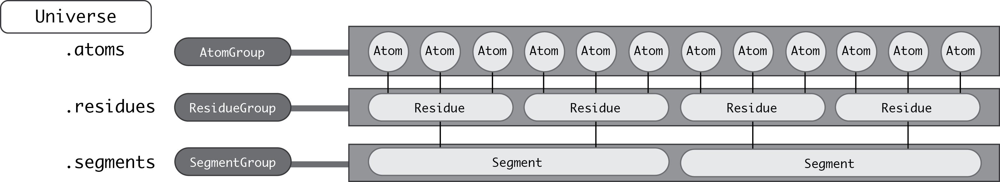

.. -*- coding: utf-8 -*-
.. _groups-of-atoms:

Groups of atoms
===============

MDAnalysis has a hierarchy of :class:`~MDAnalysis.core.groups.Atom` containers that are used throughout the code.

First and foremost is the :class:`~MDAnalysis.core.groups.AtomGroup`. An :class:`~MDAnalysis.core.groups.AtomGroup` is the primary :class:`~MDAnalysis.core.groups.Atom` container; virtually everything can be accessed through it, as detailed `above <https://www.mdanalysis.org/UserGuide/data_structures.html#atomgroup>`_. This includes chemically meaningful groups of :class:`~MDAnalysis.core.groups.Atom`\ s such as a :code:`Residue` or a :code:`Segment`. 

---------------------
Residues and Segments
---------------------

A :class:`~MDAnalysis.core.groups.Residue` is composed of :class:`~MDAnalysis.core.groups.Atom`\ s, and a :class:`~MDAnalysis.core.groups.Segment` is composed of :class:`~MDAnalysis.core.groups.Residue`\ s.

These are considered atom :ref:`topology attributes <topology-attributes>`.

The corresponding container groups are :class:`~MDAnalysis.core.groups.ResidueGroup` and :class:`~MDAnalysis.core.groups.SegmentGroup`. These have similar properties and available methods as :class:`~MDAnalysis.core.groups.AtomGroup`.

Each of these container groups can be accessed through another. For example:

.. code-block::

    >>> ag = u.atoms.select_atoms('resname ARG and name CA')
    >>> ag
    <AtomGroup with 13 atoms>
    >>> ag.residues
    <ResidueGroup with 13 residues>
    >>> ag.residues.atoms
    <AtomGroup with 312 atoms>
    >>> ag.segments
    <SegmentGroup with 1 segment>
    >>> ag.segments.atoms
    <AtomGroup with 3341 atoms>

Similarly, an :class:`~MDAnalysis.core.groups.Atom` has direct knowledge of the :class:`~MDAnalysis.core.groups.Residue` and :class:`~MDAnalysis.core.groups.Segment` it belongs to.

.. code-block::

    >>> a = u.atoms[0]
    >>> a.residue
    <Residue MET, 1>
    >>> a.residue.segment
    <Segment 4AKE>
    >>> a.residue.segment.residues
    <ResidueGroup with 214 residues>

Adding to a topology
--------------------

To add a :code:`Residue` or :code:`Segment` to a topology, use the :meth:`Universe.add_Residue <MDAnalysis.core.universe.Universe.add_Residue>` or :meth:`Universe.add_Segment <MDAnalysis.core.universe.Universe.add_Segment>` methods.

.. code-block::

    >>> u = mda.Universe(PSF, DCD)
    >>> u.segments
    <SegmentGroup with 1 segment>
    >>> u.segments.segids
    array(['4AKE'], dtype=object)
    >>> newseg = u.add_Segment(segid='X')
    >>> u.segments.segids
    array(['4AKE', 'X'], dtype=object)
    >>> newseg.atoms
    <AtomGroup with 0 atoms>

To assign the last 100 residues from the :class:`~MDAnalysis.core.universe.Universe` to this new Segment:

.. code-block::

    >>> u.residues[-100:].segments = newseg
    >>> newseg.atoms
    <AtomGroup with 1600 atoms>

Another example is `creating custom segments for protein domains <examples/constructing_universe.ipynb#Adding-a-new-segment>`_.

---------------------------
Groups of atoms in analysis
---------------------------

Certain analysis methods in MDAnalysis also make use of additional ways to group atoms.

Fragments
---------

A fragment is defined by bond connectivity. A fragment is what is typically considered a molecule: a group of atoms where each atom is bonded to at least one other atom in the fragment, and are not bonded to any atoms outside the fragment. The fragments of a Universe are determined by MDAnalysis as a derived quantity.

The fragments of an :class:`~MDAnalysis.core.groups.AtomGroup` are accessible via the :attr:`fragments` property. In the case below, there is only one fragment in the Universe:

.. code-block::

    >>> u.atoms.fragments
    (<AtomGroup with 3341 atoms>,)

Molecules
---------

In MDAnalysis, a molecule is a GROMACS-only concept. A group of atoms is considered a "molecule" if it is defined by the :code:`[ moleculetype ]` section in a `GROMACS topology <http://manual.gromacs.org/documentation/2019/reference-manual/file-formats.html#top>`_. Molecules are only defined if a Universe is created from a GROMACS topology file (i.e. with a .tpr extension). Unlike fragments, they are not accessible directly from atoms.

.. code-block:: pycon

    >>> tpr = mda.Universe(TPR)
    >>> tpr.atoms.molecules
    Traceback (most recent call last):
    File "<stdin>", line 1, in <module>
    File "MDAnalysis/core/groups.py", line 2278, in __getattr__
        cls=self.__class__.__name__, attr=attr))
    AttributeError: AtomGroup has no attribute molecules

However, the order (:code:`molnum`) and name (:code:`moltype`) of each molecule is accessible as :ref:`topology attributes <topology-attributes>`::

    >>> tpr.atoms.molnums
    array([    0,     0,     0, ..., 11086, 11087, 11088])
    >>> tpr.atoms.moltypes
    array(['AKeco', 'AKeco', 'AKeco', ..., 'NA+', 'NA+', 'NA+'], dtype=object)